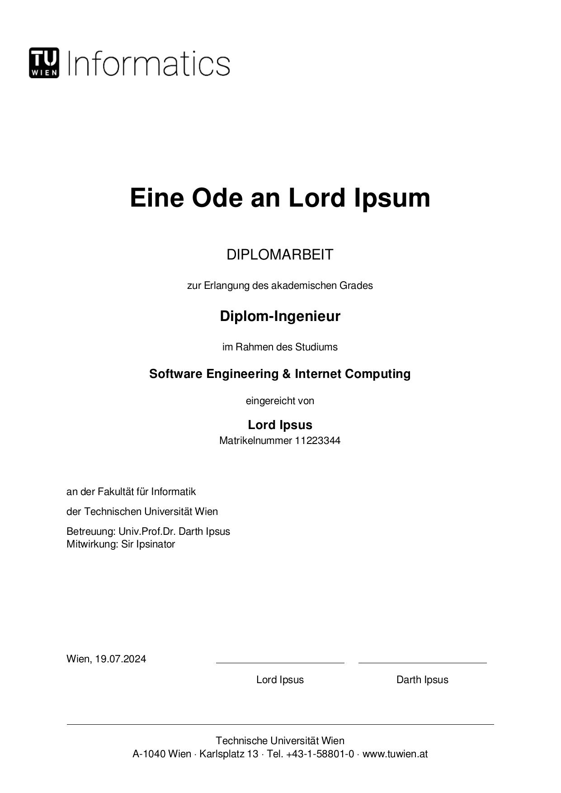

# Unofficial thesis template for informatics at TU Wien

## Usage / Testing

Set up the local package repository (see docs at https://github.com/typst/packages).

For instance on Linux:

```bash
cd ~/.local/share/
mkdir -p typst/packages/local/unofficial-tu-wien-thesis
cd "$_"
ln -s ~/the/path/to/this/repo/ 0.0.1
```

Then you can copy the template with:

```bash
typst init @local/unofficial-tu-wien-thesis
```

## Screenshot


